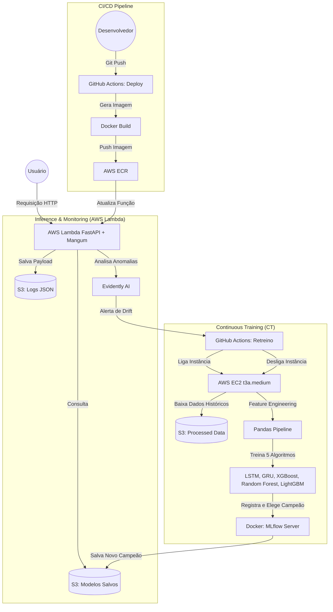

# 📈 Financial Asset Price Forecasting - MLOps Pipeline

Este projeto é uma solução completa de MLOps para previsão de fechamento de cotações da bolsa de valores. A arquitetura foi desenvolvida com foco em **Continuous Integration, Continuous Deployment (CI/CD) e Continuous Training (CT)**, atingindo o Nível 2 de maturidade em MLOps.

O sistema é composto por uma API Serverless, monitoramento ativo de Data Drift e um pipeline automatizado de retreino na nuvem que testa múltiplas arquiteturas de Machine Learning e Deep Learning.

---

## 🏗️ Arquitetura do Sistema

Abaixo está o diagrama do fluxo da aplicação. Ele ilustra desde a requisição do usuário na ponta da API até a automação de retreino disparada pela detecção de anomalias nos dados.



---

## 🛠️ Tecnologias e Ferramentas

* **API & Backend:** FastAPI, Mangum, Pydantic, Python 3.12.
* **Machine Learning:** Scikit-learn, XGBoost, LightGBM, PyTorch (Redes Neurais LSTM e GRU).
* **MLOps & Tracking:** MLflow (Servidor Dockerizado), Evidently AI (Data e Concept Drift).
* **Cloud & Infraestrutura:** AWS Lambda, AWS S3, AWS ECR, AWS EC2, Boto3.
* **Automação:** GitHub Actions (CI/CD/CT), SSH Actions.
* **Processamento e Dados:** Pandas, Numpy, Joblib, yfinance.
* **NLP & Dados Alternativos:** Finnhub API (Notícias) e HuggingFace / FinBERT (Análise de Sentimento).

---

## 🧠 Pipeline de Feature Engineering

Para capturar o comportamento dinâmico do mercado, o pipeline de dados (`app/ml/pipeline/`) não utiliza apenas o preço da ação. Ele aplica transformações e enriquece a base com dados alternativos antes do treinamento:

1. **Contexto Macro (Global):** Ingestão do índice S&P 500, índice de volatilidade (VIX) e taxa de câmbio (EUR/USD).
2. **Contexto de Sentimento (NLP):** Consumo de notícias financeiras via *Finnhub* e extração de polaridade e sentimento utilizando o modelo LLM **FinBERT** hospedado na *HuggingFace*.
3. **Indicadores Técnicos Dinâmicos:** Cálculo de Médias Móveis (SMA 20 e 50), Distância do Preço para as SMAs e Bandas de Bollinger.
4. **Osciladores e Força:** Relative Strength Index (RSI 14), MACD (Linha, Sinal e Histograma), Average True Range (ATR) e Volume Shocks.
5. **Codificação Temporal:** Extração do ciclo sazonal utilizando transformações Seno/Cosseno para dias da semana e meses.
6. **Alinhamento Preditivo:** Criação de *Lags* temporais e estruturação de janelas de tempo para o consumo das Redes Neurais (LSTM/GRU).

---

## 📡 Endpoints da API

A API está exposta via AWS Lambda e documentada pelo Swagger nativo do FastAPI. As rotas principais são:

### 1. Predição de Fechamento (`/prod/stock-data-prediction`)
Retorna a inferência do modelo para o ativo solicitado.
* **Método:** `GET`
* **Exemplo de Chamada:** `/prod/stock-data-prediction?symbol=RACE`

### 2. Monitoramento de Saúde (`/prod/monitoring/health`)
Endpoint de observabilidade para verificar o status do modelo em memória.
* **Método:** `GET`
* **Retorno Esperado:** `{"model_version": "string", "is_online": true, "total_predictions_today": 0}`

### 3. Gatilho de Data Drift (`/prod/monitoring/trigger-drift-check`)
Aciona o Evidently AI para comparar os logs de produção no S3 com a base de treinamento de referência. Se for detectado Drift (Mudança de Distribuição >= 50%), a API aciona o webhook do GitHub Actions para iniciar o EC2 e retreinar o modelo.
* **Método:** `POST`
* **Exemplo de Chamada:** `/prod/monitoring/trigger-drift-check?symbol=NVDA` (Se omitido, assume "ALL").

### 4. Relatório Visual de Drift (`/prod/monitoring/drift-report/{symbol}`)
Retorna o Dashboard HTML gerado pelo Evidently AI detalhando as variáveis que sofreram alteração estrutural no mercado.
* **Método:** `GET`
* **Exemplo de Chamada:** `/prod/monitoring/drift-report/VALE3.SA`

---

## 🚀 Como Configurar e Executar Localmente

### 1. Variáveis de Ambiente
Crie um arquivo `.env` na raiz do projeto contendo as seguintes credenciais obrigatórias:

```env
FINNHUB_API_KEY=sua_chave_finnhub
HUGGINGFACE_API_KEY=sua_chave_huggingface
AWS_ACCESS_KEY_ID=sua_chave_aws
AWS_SECRET_ACCESS_KEY=sua_secret_aws
AWS_REGION=us-east-1
GITHUB_TOKEN=seu_pat_github
GITHUB_OWNER=usuario_github
GITHUB_REPO=repositorio_github
```

### 2. Instalação
Crie seu ambiente virtual, ative-o e instale as dependências:

```bash
python -m venv venv
source venv/bin/activate  # No Windows: venv\Scripts\activate
pip install -r requirements.txt
pip install -r app/ml/requirements-ml.txt
```

### 3. Subindo a API
Para rodar o servidor FastAPI localmente para testes:
```bash
uvicorn app.api.main:app --reload
```

### 4. Executando Testes
Para rodar a suíte de testes automatizados:
```bash
pytest tests/
```

---

## 📂 Estrutura de Diretórios

O repositório está organizado utilizando os princípios do Domain-Driven Design (DDD) e Clean Architecture, separando a regra de negócio da API da esteira de Machine Learning:

```text
📦 Raiz do Projeto
├── .env
├── .github/workflows/              # Esteiras de CI/CD (Deploy e Retreino EC2)
│   ├── deploy.yml
│   └── retreino_workflow.yml
├── app/
│   ├── api/                        # Aplicação Cloud Native (FastAPI)
│   │   ├── core/                   # Configurações e singletons (S3, Logger)
│   │   ├── data/
│   │   ├── endpoints/              # Instância dos Routers
│   │   ├── models/                 # Modelos de Domínio
│   │   ├── routers/                # Regras de Rotas (Predição, Monitoramento)
│   │   ├── schemas/                # Contratos Pydantic
│   │   ├── services/               # Regras de Negócio (Drift, HuggingFace, Finnhub)
│   │   └── main.py                 # Ponto de entrada (Mangum Handler)
│   │
│   └── ml/                         # Módulo de Machine Learning (Retreino EC2)
│       ├── mlflow/                 # Artefatos Locais
│       ├── notebooks/              # EDA e Prototipação
│       ├── pipeline/               # Scripts de Random Search e Treinamento distribuído
│       ├── server/                 # Arquivos de configuração Docker (docker-compose)
│       └── requirements-ml.txt     # Dependências pesadas do ambiente de treino
├── tests/                          # Suítes do Pytest
├── docker-compose.yaml             
├── Dockerfile                      # Arquivo base para gerar imagem Lambda (ECR)
├── requirements.txt                # Dependências enxutas da API
└── README.md
```