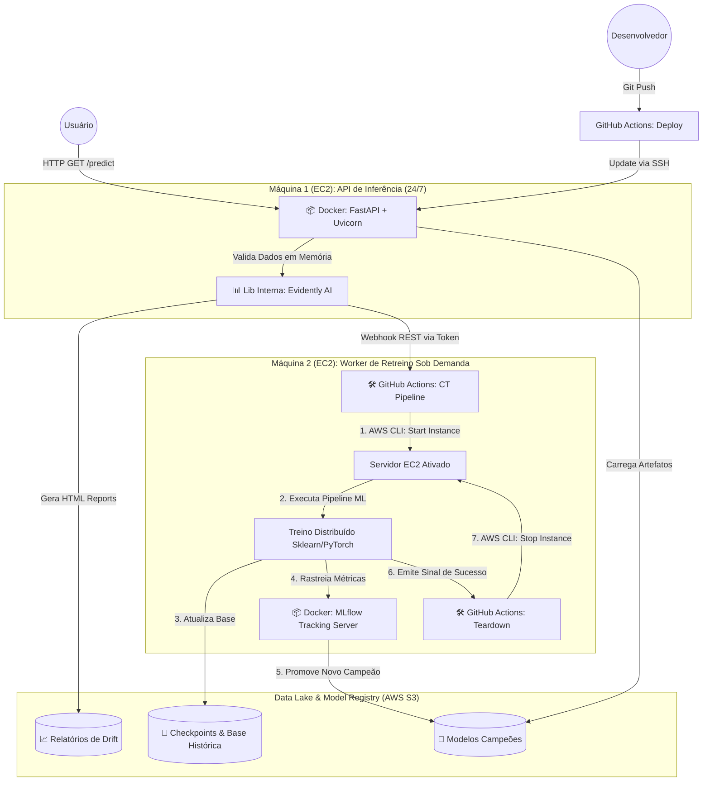

# 📈 Financial Asset Price Forecasting: Self-Healing MLOps Pipeline

Este projeto apresenta uma arquitetura avançada de MLOps orientada a eventos para previsão de ativos financeiros. Fugindo de implementações genéricas e monolíticas, o sistema adota um design *decoupled* (desacoplado), separando a camada de inferência de baixa latência do pipeline de treinamento intensivo. 

O foco principal é a resiliência e a autonomia: a aplicação monitora ativamente a degradação dos dados (*Data Drift*) em produção e orquestra seu próprio ciclo de retreino (Continuous Training) acionando infraestrutura efêmera na nuvem. É um ecossistema projetado para se adaptar dinamicamente à volatilidade do mercado financeiro sem a necessidade de intervenção humana.

---

## 🏗️ Arquitetura e Fluxo de Dados (Data Flow)

A topologia do sistema foi desenhada para garantir alta disponibilidade (HA) na ponta do usuário e otimização de custos no backend. O diagrama abaixo detalha o isolamento dos workloads e o ciclo de vida dos dados:



---

## 🛡️ Segurança e FinOps (Cloud Economics)

Sistemas em nuvem exigem governança rigorosa sobre custos e credenciais. Este projeto implementa as seguintes diretrizes:

* **Isolamento de Workload:** Para evitar que o consumo agressivo de RAM/CPU durante o treinamento derrube a API, a arquitetura utiliza instâncias EC2 distintas. 
* **Computação Efêmera (FinOps):** A "Máquina 2", responsável pelo pipeline pesado, permanece estritamente **desligada**. Ela é provisionada dinamicamente pelo GitHub Actions apenas mediante o gatilho de degradação estatística (Drift) e encerrada assim que o novo modelo é salvo no S3.
* **Zero Hardcoding & Secret Injection:** Nenhuma chave da AWS, Finnhub ou GitHub é versionada no repositório. O processo de CI/CD injeta credenciais via GitHub Secrets em um arquivo `.env` seguro na EC2, alimentando o Docker Compose via mapeamento de ambiente sem expor dados no shell.

---

## 🛠️ Stack Tecnológico

A stack foi selecionada visando performance de inferência e capacidade de experimentação:

* **Serving & Inference:** FastAPI, Pydantic, Python 3.12, Docker.
* **Machine Learning & Deep Learning:** Scikit-learn, XGBoost, LightGBM, PyTorch (Arquiteturas sequenciais LSTM e GRU).
* **MLOps & Observability:** MLflow (Tracking & Registry dockerizado), Evidently AI 0.7+ (Detecção de Drift com snapshots in-memory).
* **Cloud Infrastructure:** AWS EC2, AWS S3, Boto3 SDK.
* **Automação & Orquestração:** GitHub Actions (CI/CD para deploy seguro, CT para automação de infraestrutura via AWS CLI).
* **Engenharia de Dados:** Pandas, Numpy, yfinance (com controle estrito de fuso horário `America/Sao_Paulo` para evitar UTC hangovers no fechamento de mercado).

---

## 🧠 Pipeline de Engenharia de Atributos (Feature Engineering)

A precisão em séries temporais financeiras depende da qualidade do contexto fornecido ao estimador. O script `app/ml/notebooks/feature_engineer1.py` constrói um pipeline multivariável e idempotente:

1. **Indicadores Macroeconômicos:** Ingestão de features de mercado global como S&P 500, Volatility Index (VIX) e paridade EUR/USD para contextualizar o risco sistêmico.
2. **Inferência de NLP (Sentimento):** Integração com a API Finnhub para coleta de notícias e classificação de polaridade em lote (Batch Inference) através do modelo fundacional **FinBERT** (HuggingFace).
3. **Análise Técnica Dinâmica:** Geração vetorial de features baseadas em momentum e volatilidade: SMA (20/50), Bandas de Bollinger, RSI (14), MACD e Average True Range (ATR).
4. **Encodificação Temporal Cíclica:** Transformações matemáticas de Seno/Cosseno sobre o calendário para modelar dependências sazonais sem criar viés de grandeza linear (ex: dia da semana, mês).
5. **Robustez de Pipeline:** Estratégias de *imputation* (preenchimento de NaNs), cálculos de deltas diários (Returns) e estruturação em janelas temporais de atraso (*lookback windows*) preparadas para ingestão em tensores do PyTorch.

---

## 📡 Endpoints da API REST

A comunicação com o sistema é exposta através de uma interface RESTful documentada nativamente (Swagger/OpenAPI disponível em `/docs`).

### 1. Inferência Preditiva
Gera a predição de fechamento (*Close Price*) para o próximo dia útil do ticker especificado.
* **URL:** `/prod/stock-data-prediction`
* **Método:** `GET`
* **Parâmetros:** `symbol` (ex: NVDA, AAPL, WEGE3.SA)
* **Exemplo de uso:** 
```bash 
curl "http://localhost:8080/prod/stock-data-prediction?symbol=NVDA"
```

### 2. Monitoramento de Data Drift
Força a computação de métricas de distribuição entre a base de treino e o histórico recente. Caso o *drift score* ultrapasse o threshold definido, a API emite o Webhook para orquestrar o retreino via GitHub Actions.
* **URL:** `/prod/monitoring/trigger-drift-check`
* **Método:** `POST`
* **Query Params:** `symbol` (String, Opcional), `run_async` (Boolean, Default: false).

### 3. Observabilidade e Relatórios
Retorna um dump em HTML contendo a renderização analítica do Evidently AI com os gráficos de degradação do modelo.
* **URL:** `/prod/monitoring/drift-report/{symbol}`
* **Método:** `GET`

### 4. Health Check
Endpoint de prontidão e vivacidade (*Readiness/Liveness probe*) para monitorar a integridade do Uvicorn e o status do cache de modelos em memória.
* **URL:** `/prod/monitoring/health`
* **Método:** `GET`

---

## 🚀 Como Configurar e Executar (Local & Homologação)

### 1. Provisionamento de Segredos (.env)
Crie o arquivo de ambiente na raiz do repositório para injetar as credenciais nas bibliotecas clientes:

```env
FINNHUB_API_KEY=sua_chave_finnhub
HUGGINGFACE_API_KEY=sua_chave_huggingface
AWS_ACCESS_KEY_ID=sua_chave_aws
AWS_SECRET_ACCESS_KEY=sua_secret_aws
AWS_REGION=us-east-1
S3_BUCKET_NAME=nome_do_seu_bucket
GITHUB_TOKEN=seu_pat_github_para_retreino
GITHUB_REPOSITORY=seu_usuario/seu_repositorio
```

### 2. Deploy Local (Containerizado)
Recomendado para simular o ambiente de produção isolando as dependências do sistema host.

```bash
docker compose up --build -d
```

### 3. Setup de Desenvolvimento (Virtual Environment)
Recomendado para debugar o pipeline do Scikit-learn/Pandas ou desenvolver novos endpoints:

```bash
python -m venv venv
source venv/bin/activate  # No Windows: venv\Scripts\activate
pip install -r requirements.txt
pip install -r app/ml/requirements-ml.txt

# Iniciar o servidor ASGI com hot-reload habilitado
uvicorn app.api.main:app --host 0.0.0.0 --port 8080 --reload
```

---

## 📂 Estrutura Estratégica de Diretórios

A taxonomia do projeto reflete a separação clara de responsabilidades (Domain-Driven):

```text
📦 Raiz do Projeto
├── .env                            # Environment variables (Ignorado pelo Git)
├── .github/workflows/              # Core da automação: CI/CD (deploy.yml) e CT (retrain.yml)
├── app/
│   ├── api/                        # Submódulo: Aplicação FastAPI
│   │   ├── core/                   # Integrações de base (AWS Boto3, Logger Customizado)
│   │   ├── routers/                # Declaração dos endpoints (Predict, Monitor)
│   │   ├── schemas/                # Contratos de dados e validação estrita (Pydantic)
│   │   ├── services/               # Lógica de domínio (S3 I/O, Drift Detection, YFinance API)
│   │   ├── models/                 # Diretório de cache dinâmico para artefatos (.pkl)
│   │   └── main.py                 # Ponto de inicialização do servidor Uvicorn
│   │
│   └── ml/                         # Submódulo: MLOps & Experimentação
│       ├── features/               # Utilitários de preprocessamento bruto
│       ├── notebooks/              # Pipelines consolidados de Feature Engineering
│       ├── server/                 # Manifesto do MLflow Server (Docker Compose p/ Máquina 2)
│       ├── training/               # Rotinas de Otimização de Hiperparâmetros e Treinamento
│       └── utils/                  # Manipuladores de persistência S3 orientados a modelos
├── notebooks/                      # Sandbox para Análise Exploratória (EDA) e Prototipagem
├── tests/                          # Cobertura de testes unitários e de integração (Pytest)
├── Dockerfile                      # Declaração de imagem leve e otimizada baseada em Python
├── docker-compose.yaml             # Orquestrador local/produção da API
└── requirements.txt                # Gestão de dependências
```