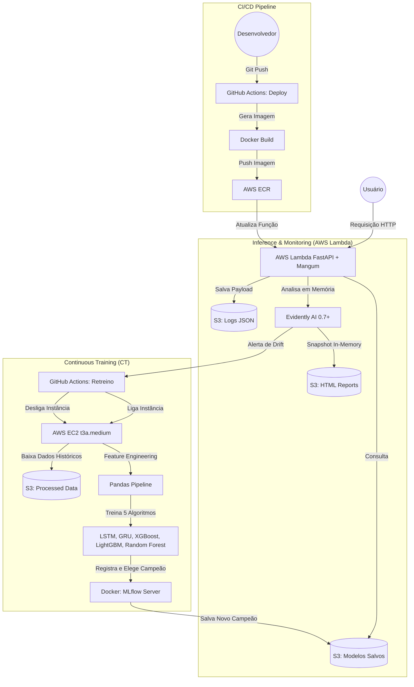

# 📈 Financial Asset Price Forecasting - MLOps Pipeline

Este projeto é uma solução completa de MLOps para previsão de fechamento de cotações da bolsa de valores. A arquitetura foi desenvolvida com foco em **Continuous Integration, Continuous Deployment (CI/CD) e Continuous Training (CT)**.

O sistema é composto por uma API Serverless, monitoramento ativo de Data Drift e um pipeline automatizado de retreino na nuvem que testa múltiplas arquiteturas de Machine Learning e Deep Learning.

---

## 🏗️ Arquitetura do Sistema

Abaixo está o diagrama do fluxo da aplicação. Ele ilustra desde a requisição do usuário na ponta da API até a automação de retreino disparada pela detecção de anomalias nos dados.



---

## 🛠️ Tecnologias e Ferramentas

* **API & Backend:** FastAPI, Mangum, Pydantic, Python 3.12.
* **Machine Learning:** Scikit-learn, XGBoost, LightGBM, PyTorch (Redes Neurais LSTM e GRU).
* **MLOps & Tracking:** MLflow (Servidor Dockerizado), Evidently AI 0.7+ (Snapshot Architecture).
* **Cloud & Infraestrutura:** AWS Lambda, AWS S3, AWS ECR, AWS EC2, Boto3.
* **Automação:** GitHub Actions (CI/CD/CT), SSH Actions.
* **Processamento e Dados:** Pandas, Numpy, Joblib, yfinance.
* **NLP & Dados Alternativos:** Finnhub API (Notícias) e HuggingFace / FinBERT (Análise de Sentimento).
* **Otimização Serverless:** In-memory HTML generation, Lazy Imports para redução de Cold Start, e caching de clientes AWS.

---

## 🧠 Pipeline de Feature Engineering

Para capturar o comportamento dinâmico do mercado, o pipeline de dados (`app/ml/pipeline/`) não utiliza apenas o preço da ação. Ele aplica transformações e enriquece a base com dados alternativos antes do treinamento:

1. **Contexto Macro (Global):** Ingestão do índice S&P 500, índice de volatilidade (VIX) e taxa de câmbio (EUR/USD).
2. **Contexto de Sentimento (NLP):** Consumo de notícias financeiras via *Finnhub* e extração de polaridade e sentimento utilizando o modelo LLM **FinBERT** hospedado na *HuggingFace*.
3. **Indicadores Técnicos Dinâmicos:** Cálculo de Médias Móveis (SMA 20 e 50), Distância do Preço para as SMAs e Bandas de Bollinger.
4. **Osciladores e Força:** Relative Strength Index (RSI 14), MACD (Linha, Sinal e Histograma), Average True Range (ATR) e Volume Shocks.
5. **Codificação Temporal:** Extração do ciclo sazonal utilizando transformações Seno/Cosseno para dias da semana e meses.
6. **Alinhamento Preditivo:** Criação de *Lags* temporais e estruturação de janelas de tempo para o consumo das Redes Neurais (LSTM/GRU).

---

---

## 📡 Endpoints da API

A API está exposta via AWS Lambda e documentada pelo Swagger nativo do FastAPI (`/prod/docs`).

### 1. Predição de Fechamento
Retorna a inferência do modelo para o ativo solicitado no próximo dia útil.
* **URL:** `/prod/stock-data-prediction`
* **Método:** `GET`
* **Parâmetros:** `symbol` (String, obrigatório)
* **Exemplo:** 
  ```bash
  curl "http://127.0.0.1:8000/prod/stock-data-prediction?symbol=NVDA"
  ```

### 2. Monitoramento de Saúde
Verifica o status operacional da API e do modelo carregado em memória.
* **URL:** `/prod/monitoring/health`
* **Método:** `GET`
* **Exemplo:** 
  ```bash
  curl "http://127.0.0.1:8000/prod/monitoring/health"
  ```

### 3. Gatilho de Data Drift
Aciona a análise comparativa entre dados de treino e logs de produção. Se o drift ultrapassar o threshold, dispara o workflow de retreino.
* **URL:** `/prod/monitoring/trigger-drift-check`
* **Método:** `POST`
* **Parâmetros:** 
  - `symbol` (String, opcional): Ticker específico (ex: RACE). Se omitido, analisa todos.
  - `run_async` (Boolean, opcional): Default `false`. Em Lambda, use `false` para garantir a conclusão da escrita no S3.
* **Exemplo:** 
  ```bash
  curl -X POST "http://127.0.0.1:8000/prod/monitoring/trigger-drift-check?symbol=AAPL&run_async=false"
  ```

### 4. Relatório Visual de Drift (Dashboard)
Retorna o Dashboard HTML interativo do Evidently AI.
* **URL:** `/prod/monitoring/drift-report/{symbol}`
* **Método:** `GET`
* **Auto-Geração:** Se o relatório não existir no S3, o sistema inicia a geração em background.
* **Exemplo:** 
  ```bash
  curl "http://127.0.0.1:8000/prod/monitoring/drift-report/NVDA"
  ```

---

## 🚀 Como Configurar e Executar Localmente

### 1. Variáveis de Ambiente
Crie um arquivo `.env` na raiz do projeto contendo as seguintes credenciais obrigatórias:

```env
FINNHUB_API_KEY=sua_chave_finnhub
HUGGINGFACE_API_KEY=sua_chave_huggingface
AWS_ACCESS_KEY_ID=sua_chave_aws
AWS_SECRET_ACCESS_KEY=sua_secret_aws
AWS_REGION=us-east-1
GITHUB_TOKEN=seu_pat_github
GITHUB_OWNER=usuario_github
GITHUB_REPO=repositorio_github
```

### 2. Instalação
Crie seu ambiente virtual, ative-o e instale as dependências:

```bash
python -m venv venv
source venv/bin/activate  # No Windows: venv\Scripts\activate
pip install -r requirements.txt
pip install -r app/ml/requirements-ml.txt
```

### 3. Subindo a API
Para rodar o servidor FastAPI localmente para testes:
```bash
uvicorn app.api.main:app --reload
```

### 4. Executando Testes
Para rodar a suíte de testes automatizados:
```bash
pytest tests/
```

---

## 📂 Estrutura de Diretórios

O repositório está organizado utilizando os princípios do Domain-Driven Design (DDD) e Clean Architecture, separando a regra de negócio da API da esteira de Machine Learning:

```text
📦 Raiz do Projeto
├── .env
├── .github/workflows/              # Esteiras de CI/CD (Deploy e Retreino EC2)
│   ├── deploy.yml
│   └── retreino_workflow.yml
├── app/
│   ├── api/                        # API FastAPI (Inference & Monitoring)
│   │   ├── core/                   # AWS Clients, Logging e Configurações
│   │   ├── routers/                # Roteadores: prediction, monitoring, stock_data
│   │   ├── services/               # Lógica: drift_detector, prediction, s3, news_service
│   │   ├── schemas/                # Schemas Pydantic para Request/Response
│   │   ├── data/                   # Logs de predições locais
│   │   ├── models/                 # Cache local de modelos (PKL)
│   │   └── main.py                 # Entry point (Mangum / Lambda)
│   │
│   └── ml/                         # MLOps: Pipeline de Treinamento
│       ├── training/               # Scripts: random_search, train, train_worker
│       ├── features/               # Pipeline de Feature Engineering
│       ├── server/                 # Infra: MLflow Docker Compose
│       ├── utils/                  # Utilitários S3 para treinamento
│       └── local_artifacts/        # Snapshots e artefatos de treino
├── notebooks/                      # Análise Exploratória (EDA) e Pesquisa
├── tests/                          # Suíte de Testes (API, ML, Services)
├── docker-compose.yaml             # Setup local do MLflow
├── Dockerfile                      # Definição da imagem para AWS Lambda
├── requirements.txt                # Dependências da API
└── README.md
```